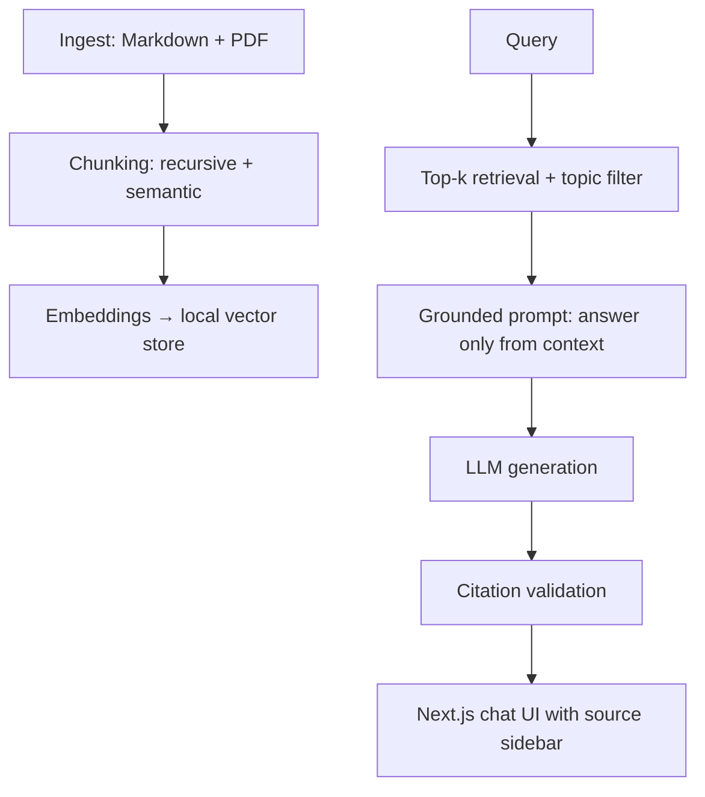

# Second Brain RAG

Personal knowledge-base assistant: ingest your own notes and PDFs, retrieve relevant chunks, and answer questions grounded in your library — with citations back to source files.

Built as a deliberate learning project to practice every layer of a RAG pipeline by hand, paralleling the production system in [verbiage](https://github.com/rclarke009/verbiage).

## Architecture

## Design decisions

- **Metadata-first schema** — every chunk carries `source_id`, `filepath`, `topic`, `doc_type`, `chunk_index`, so topic filtering (e.g. "only Swift notes") works without separate databases.
- **Recursive chunking baseline, semantic chunking where it pays off** — overlap and chunk index stored in metadata for stable citations.
- **Strict grounding** — system prompt requires explicit source references; cited chunk IDs are validated against the retrieved set, and empty-context queries refuse rather than hallucinate.
- **One topic first, many topics by design** — corpus starts narrow (easier to interpret retrieval failures while tuning chunk size/overlap/k), but the schema supports multi-topic filtering from day one.

## Stack

Python ingestion/chunking · local embeddings (Ollama) · embedded vector store · Next.js chat frontend with retrieved-chunk sidebar.

## Status

Work in progress — ingestion and chunking pipeline first, evaluation harness (gold question set + LLM-as-judge faithfulness scoring) as the stretch goal.
