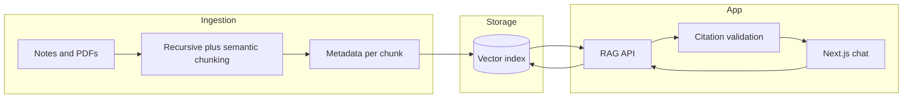

```mermaid
flowchart LR
  subgraph ingest [Ingestion]
    Notes[Notes and PDFs]
    Chunk[Recursive plus semantic chunking]
    Meta[Metadata per chunk]
  end
  subgraph store [Storage]
    VDB[(Vector index)]
  end
  subgraph app [App]
    UI[Next.js chat]
    API[RAG API]
    Val[Citation validation]
  end
  Notes --> Chunk
  Chunk --> Meta
  Meta --> VDB
  UI --> API
  API --> VDB
  VDB --> API
  API --> Val
  Val --> UI
```